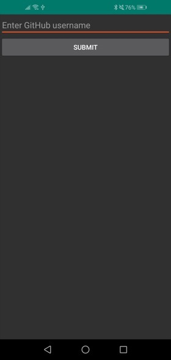
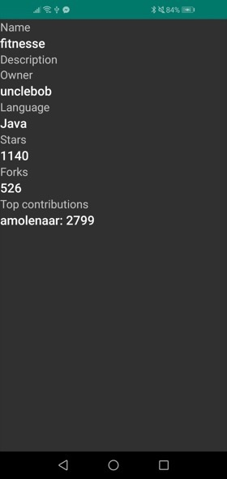

# android-retrofit-rxjava

Application (operating on the Android platform) is able to download JSON-formatted data from the 
[GitHub API][1] using the [Retrofit library][2] (only `GET` type parameters) and [RxJava][3], 
process them (using mapping etc.) and display.

## Activities

* Main

   Fetches repository list for a specified username.
   
   
   
   

* Repository details

   Gets selected repository details. Can fetch some information about top contributor. 

   
   
   

[1]: http://api.github.com/                  "Github API"
[2]: http://square.github.io/retrofit/       "Retrofit library"
[3]: https://github.com/ReactiveX/RxJava     "RxJava project"
